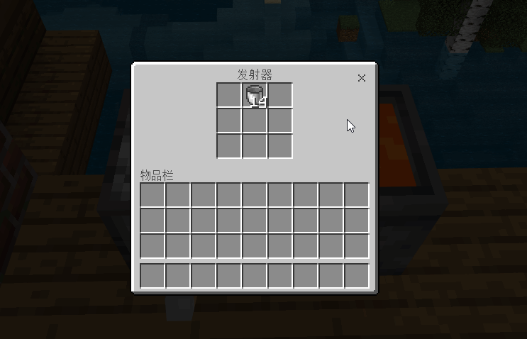

# DispenserGetLavaFromCauldron
### 使发射器能够用空桶吸取炼药锅中的岩浆

---

演示:

- 依赖 [LiteLoader.dll](https://github.com/LiteLDev/LiteLoaderBDS)加载器 `v2.2.2+`
- 将插件 `DispenserGetLavaFromCauldron.dll` 拖入`plugins`文件夹中开服即可

